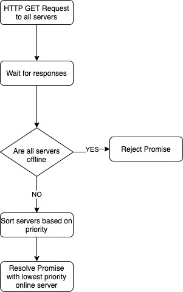

# Full-stack assignment, backend part
This assignment consists of two parts:

2. NodeJS Backend - a mainly back-end focused task, where you can show off your back-end development skills.

You can fork this repository and show your result.

Good luck!


## 2. NodeJS Back-end

Create a node module that can assess a list of webservers and then returns a server with the lowest priority. Also create a unit test that can check if the function is running properly.



#### Requirements:
- A node module that has a `findServer()` function which returns a Promise that either:
  - Resolves and return an online server with the lowest priority.
  - Reject with an error if no servers are online.

- The HTTP server requests should be used to check if the server is online or offline depending on the following requirements:
  - All server GET requests should be run in parallel.
  - The GET request should timeout after 5 seconds.
  - When the GET request responds with a statuscode of 200-299 it is considered online.

- A unit test that checks all the underlying components/requirements.
  - The server requests should be mocked.

#### JSON Array to use

```json
[
  {
    "url": "https://does-not-work.perfume.new",
    "priority": 1
  },
  {
    "url": "https://gitlab.com",
    "priority": 4
  },
  {
    "url": "http://app.scnt.me",
    "priority": 3
  },
  {
    "url": "https://offline.scentronix.com",
    "priority": 2
  }
]
```

#### What are we expecting:
- Neatly written and formatted code for production level environment
- Demonstration of knowledge on NodeJS
- Demonstration of knowledge on Promises
- Demonstration of knowledge on Unit Testing including experience with mocking target server(s).
- Impress us with the skills you have (Typescript preferred)

#### Tools and frameworks you probably want to use:
`NodeJS LTS`, `Jest`, `jest-fetch-mock`


# Results

## About the project
- NestJS with MVC
- Sequelize ORM, with migrations set up in the project, the path is src/database/migrations. One of them is for creating a table in the database in order to store the test data. The second one adds the test data from the assignment
- Setup for Postgres
- Automapper to map entities and DTOs
- Swagger and DTO properties validation
- Throttling and caching the GET requests with Redis
- Docker
- Hot reload for dev mode
- Some interceptors, an exception filter
- Versioning

## Installation

```bash
$ yarn
```

## Running the app

```bash
# development with applying the Sequelize migrations
$ yarn start

# watch mode with applying the Sequelize migrations and with hot reload
$ yarn start:hr

# production mode with applying the Sequelize migrations
$ yarn start:prod
```

## Test

```bash
# unit tests
$ yarn run test

# e2e tests
$ yarn run test:e2e

# test coverage
$ yarn run test:cov
```

## License

Nest is [MIT licensed](LICENSE).
